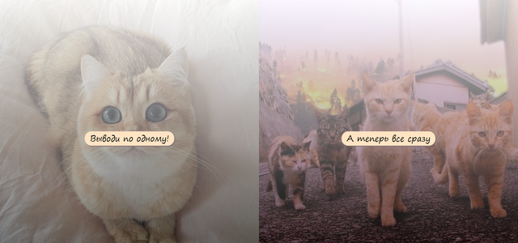
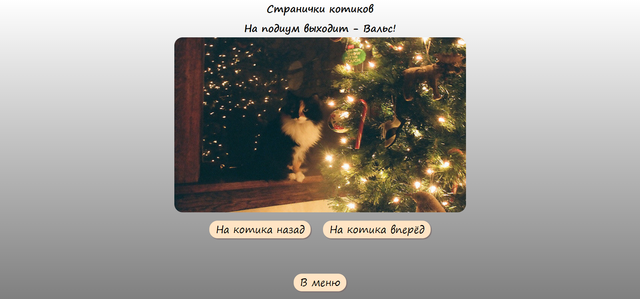

# testFEIP

Project on Flutter.

This manager of cats cans show one cat, or many cats. It's all.

To run the project:
* open console
* run next command
  * git clone git@github.com:Espanol-nikkol/testFEIP.git
  * cd testFEIP
  * npm install
  * npm run serve
* open browser
* open http://localhost:8080/

### Desktop screen

| Main Screen | MonoCat Screen | PolyCat Screen |
|----|----|---- |
 |  |  
